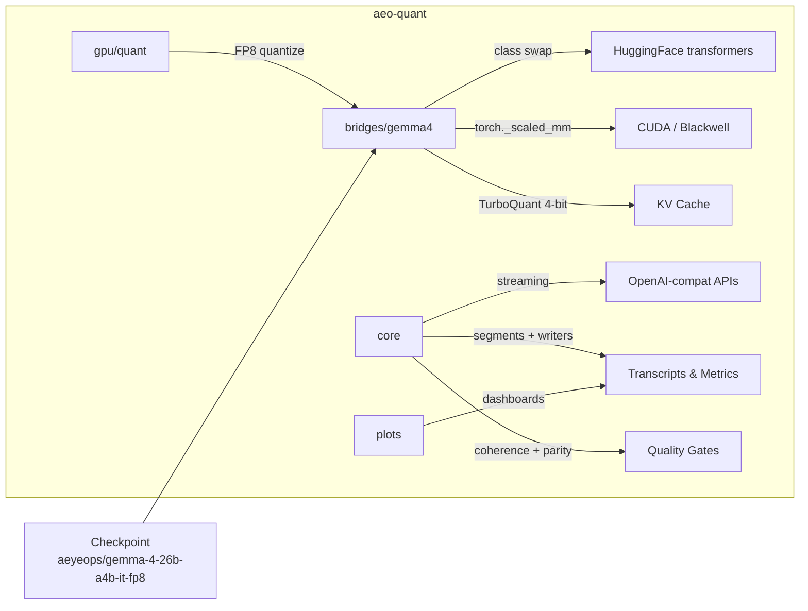

<div align="center">
<h2>Gemma 4 26B-A4B — FP8 w/ TurboQuant KV!</h2>
<p>
Full 26B MoE model in <strong>26.9 GB VRAM</strong> using FP8 quantized experts
and <a href="https://pypi.org/project/turboquant/">TurboQuant</a> 4-bit KV cache.<br>
Pre-built checkpoint ready to download and run.
</p>
<p>
<a href="https://huggingface.co/aeyeops/gemma-4-26b-a4b-it-fp8"><strong>Download Checkpoint</strong></a>
&nbsp;&middot;&nbsp;
<a href="#quickstart"><strong>Quickstart</strong></a>
&nbsp;&middot;&nbsp;
<a href="docs/gemma4-fp8-results.md"><strong>How It Was Built</strong></a>
</p>
</div>

> *"We set out to run a powerful open-source model that could take advantage
> of the latest in KV caching and the high-performance MoE architecture in
> Gemma 4. Along the way we discovered that the public FP8 checkpoints were
> broken — a module-to-linear incompatibility meant the quantized experts
> never actually loaded. So we built our own FP8 bridge, and then the
> tooling around it: benchmarks, parity gates, profiling. What started as
> a workaround became something we want to reuse and share with the
> community."*
>
> — Steve, AeyeOps

---

# aeo-quant

Quantization-aware inference and benchmarking toolkit for NVIDIA
Blackwell. First bridge: **Gemma 4 26B-A4B in FP8**. The infrastructure
is model-agnostic.

## SDK at a glance

```
aeo-quant
├── bridges/              Quantization bridges — plug into HF transformers
│   └── gemma4/             FP8 experts, class-swap loader, checkpoint builder
│
├── core/                 Model-agnostic infrastructure (stdlib only)
│   ├── streaming           OpenAI-compatible HTTP streaming client
│   ├── segments            Typed output parser (thinking, tool_call, assistant)
│   ├── coherence           Output quality validation
│   ├── context             Conversation history budget trimming
│   ├── writers             Thread-safe JSONL + CSV + HTML transcript
│   ├── analysis            Load-test analytics (percentiles, ramp detection)
│   └── types               Runtime monitor w/ kill switch, data types
│
├── gpu/                  CUDA utilities (torch + psutil)
│   ├── memory              CudaTimer, mem_report, enforce_cap
│   └── quant               FP8 quantization (3D fused, 2D standard)
│
├── plots/                Context-scaling dashboards (matplotlib)
├── prompts/              Progressive multi-turn evaluation prompts
│
└── examples/             Ready-to-run scripts
    ├── profile_generate    Timing + profiler + NVTX/nsys auto-wrap
    ├── parity_check        Greedy regression canary vs pinned baseline
    ├── quality_check       Three-prompt coherence smoke test
    ├── build_checkpoint    Shard-streaming FP8 checkpoint builder
    └── multi_turn_*        16K / 32K conversation benchmarks
```

**Layers import only what they need:** `core` is stdlib-only, `gpu` adds
torch, `bridges` adds transformers, `plots` adds matplotlib.
`import aeo_quant` is always safe.



## What it does

### Quantization bridges

- **Gemma 4 FP8 bridge.** `Gemma4TextExpertsFP8` class-swap loader —
  plugs into `from_pretrained`, loads FP8 expert weights with
  per-output-channel scales, runs MoE forward through `torch._scaled_mm`
  with per-row dynamic input quantization. Pre-built checkpoint:
  [`aeyeops/gemma-4-26b-a4b-it-fp8`](https://huggingface.co/aeyeops/gemma-4-26b-a4b-it-fp8).
- **Checkpoint builder.** Shard-streaming FP8 quantization from bf16
  safetensors — peaks ~18 GB RSS, never materializes full weights.

### Inference benchmarking

- **Profile generator.** CUDA-event timing, `torch.profiler` kernel
  trace, NVTX markers with nsys auto-wrap (`AEO_MOE_TRACE=1`).
- **Multi-turn benchmarks.** 16K / 32K context runs with JSONL
  transcripts, CSV metrics, HTML viewer, and 4-panel PNG dashboards.
- **Parity check.** 50-token greedy regression canary vs pinned baseline.
- **Quality check.** Three-prompt coherence smoke test.

### Model-agnostic infrastructure

- **Runtime monitor.** Thread-safe sampling of memory, KV%, throughput
  with kill switch on threshold breach.
- **Memory management.** `CudaTimer`, `mem_report()`, `enforce_cap()`.
- **Streaming client.** OpenAI-compatible HTTP streaming with TTFT,
  usage, health polling, model discovery.
- **Output parsing.** `MarkerStreamParser` — typed segments (thinking,
  tool_call, assistant), every byte accounted for.
- **Transcript writer.** Thread-safe JSONL + CSV with embedded HTML
  viewer.
- **Context budget.** `trim_history_to_budget()` — preserves system
  prompt, drops oldest pairs.
- **Coherence checker.** Repetition, garbage, printable ASCII
  validation.
- **Load-test analytics.** Percentiles, ramp detection, per-level stats.
- **Dashboards.** 4-panel PNG: tok/s, memory, thinking ratio, time vs
  context fill.
- **Prompt library.** Progressive multi-turn coding specs and follow-up
  patterns.

## Hardware support

- **Target:** NVIDIA GB10 Max Pro (Blackwell `sm_121`, ARM64, 128 GB
  unified LPDDR5x).
- **GPU-only.** The code fails fast if CUDA is unavailable. There is no
  CPU fallback path and no intention to add one.
- **Requires FP8 hardware.** `torch._scaled_mm` with
  `torch.float8_e4m3fn` needs Hopper or Blackwell. Earlier GPUs are not
  supported.
- Tested on a single-GPU unified-memory configuration. Multi-GPU has not
  been exercised.

## Installation

Python 3.12+ is required. The package uses optional extras to keep the
dependency surface bounded to whatever you actually need.

```bash
# Clone and install with the Gemma 4 bridge stack
git clone https://github.com/AeyeOps/aeo-quant.git
cd aeo-quant
uv pip install -e '.[bridges]'

# Or with all extras (bridges + plots + dev)
uv pip install -e '.[all,dev]'
```

Available extras (see `pyproject.toml`):

| Extra | Adds |
|---|---|
| `gpu` | `torch`, `psutil` |
| `bridges` | everything in `gpu` plus `transformers`, `accelerate`, `safetensors`, `turboquant` |
| `plots` | `matplotlib` |
| `all` | `bridges` + `plots` |
| `dev` | `pytest`, `ruff` |

The `core` layer is stdlib-only and is always importable; the other
layers are guarded behind `try/except ImportError` so `import aeo_quant`
works even without the heavy dependencies.

## Configuration

Every example script reads a `.env` file from the current directory (or
any parent directory). Create one next to the script you run:

```
FP8_CHECKPOINT=aeyeops/gemma-4-26b-a4b-it-fp8
HF_TOKEN=hf_your_token_here
```

`FP8_CHECKPOINT` accepts either a Hugging Face model ID (downloaded
automatically) or a local path to a checkpoint you built yourself.

`.env` overrides any existing environment variables; this is
intentional, so you have a single source of truth per checkout.

## Quickstart

All examples live in `examples/` and are meant to be read, copied, and
adapted.

### 1. Get a checkpoint

The pre-built FP8 checkpoint is published on the Hub:
[**aeyeops/gemma-4-26b-a4b-it-fp8**](https://huggingface.co/aeyeops/gemma-4-26b-a4b-it-fp8).
Set `FP8_CHECKPOINT=aeyeops/gemma-4-26b-a4b-it-fp8` in your `.env`
and the loader will download it automatically on first run.

> **Why not use Google's FP8 releases?** The public
> `google/gemma-4-26B-A4B-it` FP8 checkpoints ship with layouts that
> fail to load on `transformers 5.5.3` — either the FP8 expert bytes
> never get quantized (garbage output) or the unfused per-expert layout
> is incompatible with the fused 3D `Gemma4TextExperts` module. See
> [`docs/gemma4-fp8-results.md`](docs/gemma4-fp8-results.md) for the
> full teardown.

**Building your own checkpoint** (optional): If you'd rather quantize
from the bf16 source yourself:

```bash
uv run python examples/build_checkpoint.py
```

This streams shards one at a time, quantizes fused 3D MoE experts via
`quantize_3d_to_fp8()`, and writes sharded FP8 output. Peaks ~18 GB
RSS; never touches the GPU.

### 2. Verify it loads and generates

```bash
uv run python examples/quality_check.py
```

Loads the FP8 checkpoint, runs three prompts (code, prose, mixed), and
fails fast on repetition loops, garbage tokens, or tok/s below a
threshold. This is the smoke test to run after a fresh build.

### 3. Check a change hasn't broken parity

```bash
uv run python examples/parity_check.py
```

Generates 50 greedy tokens from a fixed prompt, diffs against a pinned
baseline (`tests/fixtures/parity_baseline.txt`), and fails on >5% token
divergence. If no baseline exists, the first run pins one. Use this as
a regression canary when tweaking the decode path.

### 4. Profile where time goes

```bash
uv run python examples/profile_generate.py
```

Runs a short generation with CUDA-event timing for
tokenize / prefill / decode separately, then (optionally) a
`torch.profiler` trace sorted by CUDA time. Useful environment knobs:

```bash
PROFILE_TRACE=1  uv run python examples/profile_generate.py   # include kernel trace
COMPARE_KV=1     uv run python examples/profile_generate.py   # TurboQuant vs native cache
GEN_TOKENS=200   uv run python examples/profile_generate.py   # longer measurement
AEO_MOE_TRACE=1  uv run python examples/profile_generate.py   # auto-wrap under nsys with NVTX markers
```

### 5. Run a multi-turn benchmark

```bash
uv run python examples/multi_turn_16k.py    # 16K context target
uv run python examples/multi_turn_32k.py    # 32K context target
```

Full multi-turn conversations with progressive follow-ups. Each run
produces a timestamped results directory with JSONL transcript, CSV
metrics, an HTML conversation viewer, and a context-scaling dashboard
PNG.

See [`examples/README.md`](examples/README.md) for the full walkthrough
of every script.

## Documentation

Deep dives on the Gemma 4 FP8 work live in `docs/`:

- [`docs/gemma4-fp8-results.md`](docs/gemma4-fp8-results.md) — why the
  public checkpoints are broken, how the self-built checkpoint is
  constructed, and the validation numbers (99.2% greedy-token match vs
  bf16 reference).
- [`docs/gemma4-fp8-optimization.md`](docs/gemma4-fp8-optimization.md) —
  decode-path optimization log: what was tried, what shipped, what was
  rejected, and the active plan.
- [`docs/gemma4-fp8-retrospective.md`](docs/gemma4-fp8-retrospective.md)
  — retrospective on the build effort: what worked, what didn't,
  lessons.
- [`docs/turboquant-gemma4-research.md`](docs/turboquant-gemma4-research.md)
  — background notes on TurboQuant KV cache compression with Gemma 4.

## Status and caveats

- **Use the published checkpoint.** The pre-built FP8 checkpoint is at
  [`aeyeops/gemma-4-26b-a4b-it-fp8`](https://huggingface.co/aeyeops/gemma-4-26b-a4b-it-fp8)
  on the Hub. Google's own FP8/NVFP4 releases ship broken expert
  weights — see `docs/gemma4-fp8-results.md` for why. You can also
  build your own from the bf16 source via `examples/build_checkpoint.py`.
- **No pinned dependency versions.** `pyproject.toml` currently uses
  loose lower bounds. If something stops working, compare against the
  combination the docs were written against (`transformers 5.5.3`,
  `compressed-tensors 0.15.0.1`, `turboquant 0.2.0`).
- **Single architecture.** Only Gemma 4 has a bridge today. The
  `core`/`gpu`/`plots` layers are model-agnostic — adding another
  architecture means writing a new `bridges/<model>/` module.
- **Actively evolving.** The decode path and parity harness are being
  iterated on; see the active optimization plan linked from
  `docs/gemma4-fp8-optimization.md`.

## License

Apache 2.0 — see [`LICENSE`](LICENSE).
