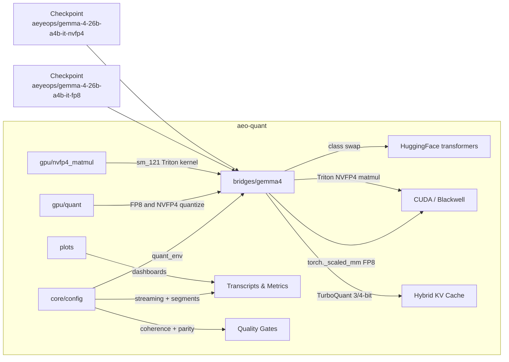

<div align="center">
<h2>Gemma 4 26B-A4B — FP8 and NVFP4 w/ TurboQuant KV</h2>
<p>
Full 26B MoE model in <strong>~27 GB</strong> (FP8) or <strong>~19 GB</strong> (NVFP4) quantized experts,
paired with <a href="https://pypi.org/project/turboquant/">TurboQuant</a> 3-bit / 4-bit KV cache.<br>
Two pre-built checkpoints ready to download and run on consumer Blackwell (GB10).
</p>
<p>
<a href="https://huggingface.co/aeyeops/gemma-4-26b-a4b-it-fp8"><strong>Download FP8</strong></a>
&nbsp;&middot;&nbsp;
<a href="https://huggingface.co/aeyeops/gemma-4-26b-a4b-it-nvfp4"><strong>Download NVFP4</strong></a>
&nbsp;&middot;&nbsp;
<a href="#quickstart"><strong>Quickstart</strong></a>
&nbsp;&middot;&nbsp;
<a href="docs/gemma4-fp8-results.md"><strong>FP8 deep dive</strong></a>
&nbsp;&middot;&nbsp;
<a href="docs/2026-04-17-nvfp4-sm121-breakthrough.md"><strong>NVFP4 deep dive</strong></a>
</p>
</div>

> *"We set out to run a powerful open-source model that could take advantage
> of the latest in KV caching and the high-performance MoE architecture in
> Gemma 4. Along the way we discovered that the public FP8 checkpoints were
> broken — a module-to-linear incompatibility meant the quantized experts
> never actually loaded. So we built our own FP8 bridge, and then the
> tooling around it: benchmarks, parity gates, profiling. With FP8 proven,
> we pushed further into FP4: a native Triton `mma.sync.*.kind::mxf4nvf4`
> matmul on consumer Blackwell, kernel-side expert gather for MoE decode,
> and a sliding-window-aware hybrid KV cache. What started as a workaround
> became something we want to reuse and share with the community."*
>
> — Steve, AeyeOps

---

# aeo-quant

Quantization-aware inference and benchmarking toolkit for NVIDIA
Blackwell. First architecture: **Gemma 4 26B-A4B in FP8 and NVFP4**. The
infrastructure is model-agnostic.

## SDK at a glance

```
aeo-quant
├── bridges/              Quantization bridges — plug into HF transformers
│   └── gemma4/             FP8 + NVFP4 experts, class-swap loader, checkpoint builders,
│                           native Triton matmul, hybrid sliding-window KV cache
│
├── core/                 Model-agnostic infrastructure (stdlib only)
│   ├── streaming           OpenAI-compatible HTTP streaming client
│   ├── segments            Typed output parser (thinking, tool_call, assistant)
│   ├── coherence           Output quality validation
│   ├── context             Conversation history budget trimming
│   ├── writers             Thread-safe JSONL + CSV + HTML transcript
│   ├── analysis            Load-test analytics (percentiles, ramp detection)
│   └── config              `quant_env()` — QUANT_FORMAT, checkpoint dispatch, sm120 coerce
│
├── gpu/                  CUDA utilities (torch + psutil)
│   ├── memory              CudaTimer, mem_report, enforce_cap
│   ├── quant               FP8 and NVFP4 quantization (2D and 3D fused)
│   └── nvfp4_matmul        Native Triton NVFP4 matmul kernels (2D prefill, 3D decode)
│
├── plots/                Context-scaling dashboards (matplotlib)
├── prompts/              Progressive multi-turn evaluation prompts
│
└── examples/             Ready-to-run scripts (all honor QUANT_FORMAT)
    ├── profile_generate    Timing + profiler + NVTX/nsys auto-wrap
    ├── parity_check        Greedy regression canary vs pinned baseline (per-format)
    ├── parity_long_check   2000-token regression gate (crosses SWA boundary)
    ├── quality_check       Three-prompt coherence smoke test
    ├── reasoning_check     Two hard reasoning prompts, 500 tokens each
    ├── build_checkpoint    Shard-streaming FP8 checkpoint builder
    ├── build_checkpoint_nvfp4  Shard-streaming NVFP4 checkpoint builder
    └── multi_turn_*        16K / 32K conversation benchmarks
```

**Layers import only what they need:** `core` is stdlib-only, `gpu` adds
torch, `bridges` adds transformers, `plots` adds matplotlib.
`import aeo_quant` is always safe.



## What it does

### Quantization bridges

- **Gemma 4 FP8 bridge.** `Gemma4TextExpertsFP8` class-swap loader —
  plugs into `from_pretrained`, loads FP8 expert weights with
  per-output-channel scales, runs MoE forward through `torch._scaled_mm`
  with per-row dynamic input quantization. Pre-built checkpoint:
  [`aeyeops/gemma-4-26b-a4b-it-fp8`](https://huggingface.co/aeyeops/gemma-4-26b-a4b-it-fp8).
- **Gemma 4 NVFP4 bridge.** `Gemma4TextExpertsNVFP4` class-swap loader —
  same plug-in pattern, but with packed FP4 E2M1 weights, FP8 per-block
  scales, and FP32 per-tensor scales. Forward pass runs through custom
  Triton kernels (`nvfp4_linear_prequantized` for prefill,
  `nvfp4_linear_3d_gather` for M=1 decode) that drive consumer Blackwell's
  `mma.sync.*.kind::mxf4nvf4` FP4 MMA instruction directly — no intermediate
  dequant to FP8. Pre-built checkpoint:
  [`aeyeops/gemma-4-26b-a4b-it-nvfp4`](https://huggingface.co/aeyeops/gemma-4-26b-a4b-it-nvfp4).
- **Checkpoint builders.** Shard-streaming FP8 and NVFP4 quantization
  from bf16 safetensors — peaks ~18 GB RSS, never materializes full
  weights.
- **Hybrid sliding-window KV cache.** `Gemma4HybridTurboQuantCache`
  respects Gemma 4's 25 sliding-window layers + 5 full-attention layers,
  capping compressed storage on sliding layers at `sliding_window − 1 − residual_len`
  tokens. At 16K–32K context, eliminates ~80% of the per-step dequant
  work on masked-out KV positions.

### Inference benchmarking

- **Profile generator.** CUDA-event timing, `torch.profiler` kernel
  trace, NVTX markers with nsys auto-wrap (`AEO_MOE_TRACE=1`).
- **Multi-turn benchmarks.** 16K / 32K context runs with JSONL
  transcripts, CSV metrics, HTML viewer, and 4-panel PNG dashboards.
- **Parity check.** 50-token greedy regression canary vs pinned
  per-format baseline. NVFP4 additionally reports an informational
  FP8-baseline delta.
- **Long parity check.** 2000-token regression gate — crosses Gemma 4's
  1024-token sliding window so SWA-eviction bugs surface.
- **Quality check.** Three-prompt coherence smoke test.
- **Reasoning check.** Two hard prompts (math proof, concurrent bug
  hunt), 500 tokens each.

### Model-agnostic infrastructure

- **Harness daemon.** `aeo-harness` — long-running UNIX-socket service
  that loads the model once and serves workload requests from multiple
  clients. Eliminates the ~120s load cost per invocation.
- **Runtime monitor.** Thread-safe sampling of memory, KV%, throughput
  with kill switch on threshold breach.
- **Memory management.** `CudaTimer`, `mem_report()`, `enforce_cap()`.
- **Streaming client.** OpenAI-compatible HTTP streaming with TTFT,
  usage, health polling, model discovery.
- **Output parsing.** `MarkerStreamParser` — typed segments (thinking,
  tool_call, assistant), every byte accounted for.
- **Transcript writer.** Thread-safe JSONL + CSV with embedded HTML
  viewer.
- **Context budget.** `trim_history_to_budget()` — preserves system
  prompt, drops oldest pairs.
- **Coherence checker.** Repetition, garbage, printable ASCII
  validation.
- **Load-test analytics.** Percentiles, ramp detection, per-level stats.
- **Dashboards.** 4-panel PNG: tok/s, memory, thinking ratio, time vs
  context fill.
- **Prompt library.** Progressive multi-turn coding specs and follow-up
  patterns.

## Hardware support

- **Target:** NVIDIA GB10 Max Pro (Blackwell `sm_121`, ARM64, 128 GB
  unified LPDDR5x).
- **GPU-only.** The code fails fast if CUDA is unavailable. There is no
  CPU fallback path and no intention to add one.
- **FP8 path requires FP8 hardware.** `torch._scaled_mm` with
  `torch.float8_e4m3fn` needs Hopper or Blackwell. Earlier GPUs are not
  supported.
- **NVFP4 path requires consumer Blackwell.** Validated on `sm_121`
  (GB10) via `TRITON_OVERRIDE_ARCH=sm120` (auto-set by `quant_env()`).
  Datacenter Blackwell (`sm_100`, B100/B200) uses a different FP4 MMA
  encoding and has not been tested. Requires Triton ≥ 3.5.
- Tested on a single-GPU unified-memory configuration. Multi-GPU has not
  been exercised.

## Installation

Python 3.12+ is required. The package uses optional extras to keep the
dependency surface bounded to whatever you actually need.

```bash
# Clone and install with the Gemma 4 bridge stack
git clone https://github.com/AeyeOps/aeo-quant.git
cd aeo-quant
uv pip install -e '.[bridges]'

# Or with all extras (bridges + plots + dev)
uv pip install -e '.[all,dev]'
```

Available extras (see `pyproject.toml`):

| Extra | Adds |
|---|---|
| `gpu` | `torch`, `psutil` |
| `bridges` | everything in `gpu` plus `transformers`, `accelerate`, `safetensors`, `turboquant` |
| `plots` | `matplotlib` |
| `all` | `bridges` + `plots` |
| `dev` | `pytest`, `ruff` |

The `core` layer is stdlib-only and is always importable; the other
layers are guarded behind `try/except ImportError` so `import aeo_quant`
works even without the heavy dependencies.

## Configuration

Every example script reads a `.env` file from the current directory (or
any parent directory). Pick a `QUANT_FORMAT` and set the matching
checkpoint path (or HF repo ID):

```
# Pick one format. Defaults to fp8 if unset.
QUANT_FORMAT=nvfp4

# Checkpoints (HF repo ID or local path). Set whichever you use.
FP8_CHECKPOINT=aeyeops/gemma-4-26b-a4b-it-fp8
NVFP4_CHECKPOINT=aeyeops/gemma-4-26b-a4b-it-nvfp4
```

For HuggingFace authentication, run `hf auth login` once. The token is
cached at `~/.cache/huggingface/token` and both the `hf` CLI and
`huggingface_hub` pick it up automatically — no `HF_TOKEN` env var
needed. Don't put `HF_TOKEN` in `.env`: it would shadow the cached
token and force a second place to rotate on a leak.

`quant_env()` resolves `QUANT_FORMAT` + the matching `*_CHECKPOINT` and
(for nvfp4) auto-applies `TRITON_OVERRIDE_ARCH=sm120` before Triton
compiles. `KV_BITS` defaults to 4 for FP8 and 3 for NVFP4.

`.env` overrides any existing environment variables; this is
intentional, so you have a single source of truth per checkout.

## Quickstart

All examples live in `examples/` and are meant to be read, copied, and
adapted. Every example honors `QUANT_FORMAT` — switch between FP8 and
NVFP4 without touching the code.

### 1. Get a checkpoint

Both formats are published on the Hub:

- **FP8** — [**aeyeops/gemma-4-26b-a4b-it-fp8**](https://huggingface.co/aeyeops/gemma-4-26b-a4b-it-fp8)
  — 27 GB artifact, 60 FP8 expert tensors + 60 bf16 scales + 953 bf16
  pass-through.
- **NVFP4** — [**aeyeops/gemma-4-26b-a4b-it-nvfp4**](https://huggingface.co/aeyeops/gemma-4-26b-a4b-it-nvfp4)
  — 19 GB artifact, 180 NVFP4 buffers (packed uint8 + fp8 block scales +
  fp32 tensor scales) + 953 bf16 pass-through. Consumer Blackwell only.

Set the matching `*_CHECKPOINT` in your `.env` and the loader will
download it automatically on first run.

> **Why not use Google's FP8 / NVFP4 releases?** The public
> `google/gemma-4-26B-A4B-it` quantized checkpoints ship with layouts
> that fail to load on `transformers 5.5.3` — standard quantization
> tools walk `nn.Linear` modules and silently skip the 3D fused
> `Gemma4TextExperts` tensors (91% of model parameters). See
> [`docs/gemma4-fp8-results.md`](docs/gemma4-fp8-results.md) for the
> full teardown.

**Building your own checkpoint** (optional):

```bash
uv run python examples/build_checkpoint.py         # FP8
uv run python examples/build_checkpoint_nvfp4.py   # NVFP4
```

Both stream shards one at a time, quantize fused 3D MoE experts, and
write sharded output. Peak ~18 GB RSS; never touches the GPU.

### 2. Verify it loads and generates

```bash
uv run python examples/quality_check.py                          # defaults to fp8
QUANT_FORMAT=nvfp4 uv run python examples/quality_check.py       # nvfp4 path
```

Loads the checkpoint, runs three prompts (code, prose, mixed), and
fails fast on repetition loops, garbage tokens, or tok/s below a
threshold. This is the smoke test to run after a fresh build.

### 3. Check a change hasn't broken parity

```bash
uv run python examples/parity_check.py                           # fp8
QUANT_FORMAT=nvfp4 uv run python examples/parity_check.py        # nvfp4
```

Generates 50 greedy tokens from a fixed prompt, diffs against a pinned
per-format baseline (`tests/fixtures/parity_baseline_<format>.txt`), and
fails on >5% token divergence. NVFP4 runs additionally report an
informational delta vs the FP8 baseline. If no baseline exists, the
first run pins one. Use this as a regression canary when tweaking the
decode path.

For longer-context coverage:

```bash
QUANT_FORMAT=nvfp4 uv run python examples/parity_long_check.py
```

This 2000-token gate crosses Gemma 4's 1024-token sliding window — any
SWA-eviction bug surfaces here that the 50-token canary misses.
Threshold: 0.5%.

### 4. Profile where time goes

```bash
uv run python examples/profile_generate.py
```

Runs a short generation with CUDA-event timing for
tokenize / prefill / decode separately, then (optionally) a
`torch.profiler` trace sorted by CUDA time. Useful environment knobs:

```bash
PROFILE_TRACE=1        uv run python examples/profile_generate.py   # include kernel trace
COMPARE_KV=1           uv run python examples/profile_generate.py   # TurboQuant vs native cache
GEN_TOKENS=200         uv run python examples/profile_generate.py   # longer measurement
AEO_MOE_TRACE=1        uv run python examples/profile_generate.py   # auto-wrap under nsys with NVTX markers
PROFILE_MIN_FREE_GB=45 uv run python examples/profile_generate.py   # relax preflight floor when co-resident with vLLM etc.
```

### 5. Run a multi-turn benchmark

```bash
uv run python examples/multi_turn_16k.py    # 16K context target
uv run python examples/multi_turn_32k.py    # 32K context target
```

Full multi-turn conversations with progressive follow-ups. Each run
produces a timestamped results directory with JSONL transcript, CSV
metrics, an HTML conversation viewer, and a context-scaling dashboard
PNG.

See [`examples/README.md`](examples/README.md) for the full walkthrough
of every script.

## Documentation

Deep dives on the Gemma 4 quantization work live in `docs/`:

- [`docs/gemma4-fp8-results.md`](docs/gemma4-fp8-results.md) — why the
  public checkpoints are broken, how the FP8 checkpoint is constructed,
  and the validation numbers (99.2% greedy-token match vs bf16 reference).
- [`docs/gemma4-fp8-optimization.md`](docs/gemma4-fp8-optimization.md) —
  FP8-era decode-path optimization log: what was tried, what shipped,
  what was rejected. Superseded by the NVFP4 track; see the
  `docs/plans/` dated writeups and
  [`docs/plans/2026-04-23-in-transformers-envelope-closed.md`](docs/plans/2026-04-23-in-transformers-envelope-closed.md)
  for the current state.
- [`docs/gemma4-fp8-retrospective.md`](docs/gemma4-fp8-retrospective.md)
  — retrospective on the FP8 build effort: what worked, what didn't,
  lessons.
- [`docs/2026-04-17-nvfp4-sm121-breakthrough.md`](docs/2026-04-17-nvfp4-sm121-breakthrough.md)
  — NVFP4 on consumer Blackwell: native Triton `tl.dot_scaled` path,
  3D fused-experts kernel, kernel-side expert gather, measured tok/s
  progression across decode-optimization rounds.
- [`docs/turboquant-gemma4-research.md`](docs/turboquant-gemma4-research.md)
  — background notes on TurboQuant KV cache compression with Gemma 4.

## Decode throughput journey

Three weeks of incremental optimization on Gemma 4 26B-A4B (GB10
`sm_121`, TurboQuant KV). Headline decode tok/s by milestone:

| Milestone | Decode tok/s |
|---|--:|
| v0.1.0 — FP8 bridge, bf16 dequant baseline | 7.82 |
| v0.1.0 — FP8 bridge, `torch._scaled_mm` | 8.96 |
| v0.1.4 — NVFP4 load-time path, per-expert loop | ~6.8 |
| 2026-04-17 — 3D fused-experts Triton kernel | ~12.5–13.7 |
| v0.1.12 — Host-sync removal, cached FP4 bounds | ~15.8 |
| v0.1.14 — Kernel-side expert gather for MoE decode | ~18.7 |
| 2026-04-23 — In-`transformers` envelope | 16–19 |

Measurement setups vary across releases (prompt length, decode
window); per-release detail in [`CHANGELOG.md`](CHANGELOG.md). Closing
writeup with post-0.1.14 CUDA-time breakdown:
[`docs/plans/2026-04-23-in-transformers-envelope-closed.md`](docs/plans/2026-04-23-in-transformers-envelope-closed.md).

## What we tried that didn't make the cut

For anyone using this as a reference: the optimization track has a
matching list of dead ends, each a full implement-and-measure exercise
rather than a back-of-the-envelope rejection.

**Quality regressions**

- **FP8 on the 206 non-MoE Linears.** −840 MB VRAM, but 0% decode
  speedup and 46% parity divergence; per-row scale was the failure
  mode. MoE-only FP8 stayed the shipped configuration. See
  `CHANGELOG.md` v0.1.1.
- **NVFP4 on attention projections + `lm_head`** (116 modules). 88%
  token divergence at decode step 5; FP4's ~13% per-matmul RMS noise
  floor compounds past argmax tolerance on Gemma 4's 262K vocab — the
  math is fundamental, not a code defect. See
  [`docs/plans/2026-04-20-cuda-graph-handoff.md`](docs/plans/2026-04-20-cuda-graph-handoff.md).
- **3-bit KV cache as default.** Produces correct reasoning at 3-bit
  but 86–98% token divergence vs 4-bit from cascade through the
  attention stack, and no decode speedup. 4-bit stays default below
  128K context. See `CHANGELOG.md` v0.1.2.

**Performance no change or worse**

- **Fixed-buffer capturable KV cache** (for `torch.cuda.graph` capture
  of the decode step). Both our V1 implementation and HF's
  `StaticCache` diverged identically from `Gemma4HybridTurboQuantCache`
  at decode step 49 — fixed-buffer / zero-padded K/V is not
  numerically equivalent to the hybrid cache under HF's attention
  path. Cache-level graph capture is blocked on this model. See
  [`docs/plans/2026-04-20-cuda-graph-handoff.md`](docs/plans/2026-04-20-cuda-graph-handoff.md).
- **`torch.compile(mode="reduce-overhead")`** in the loader. No-op via
  `transformers.generate()` (HF bypasses `OptimizedModule.__call__`),
  and actively harmful on direct `model(...)` calls — `cudagraph_trees`
  conflicts with our cache growth and with explicit graph capture.
  Stripped in v0.1.13.
- **`.fp8_cache/` conversion sidecar.** Intended to skip 30–60s
  NVFP4→FP8 conversion on subsequent loads. After the batched-16-
  experts optimization brought conversion to ~10s, the cache's ~124s
  disk I/O was consistently ~114s *slower* than just reconverting.
  Removed in v0.1.5.
- **Routing batching** (`bmm` and packed expert variants). On GB10 at
  M=1 decode, the eager Python expert loop beat every batched variant
  we wrote. Launch overhead wasn't the bottleneck we assumed it was
  until the 3D fused-experts Triton kernel attacked it from a
  different angle.

**Not a significant improvement**

Three "probe-first" levers from the post-v0.1.14 inventory were
dispositioned without a full probe because the trace made the upper
bound unambiguous:

- **Router NVFP4** — the existing 2D `_nvfp4_matmul_kernel` already
  accounts for 1.12% of CUDA time; residual bf16 router work isn't a
  distinct bucket in the top-40. Upper bound on gain ≪ 1% wall-clock.
- **Per-shape prefill autotune** — prefill is 5.5% of total wall-clock;
  a 3× prefill speedup nets ~0.55 tok/s and doesn't move the decode
  headline.
- **MoE activation-quant elementwise fusion** — ~8% of CUDA time;
  fusion best case 2–3% wall-clock, or 0.3–0.5 tok/s at current
  rates. Inside envelope noise.

Full disposition with CUDA-time measurements and kernel-level math:
[`docs/plans/2026-04-23-in-transformers-envelope-closed.md`](docs/plans/2026-04-23-in-transformers-envelope-closed.md).

## Status and caveats

- **Use the published checkpoints.** Both pre-built checkpoints are on
  the Hub: [`aeyeops/gemma-4-26b-a4b-it-fp8`](https://huggingface.co/aeyeops/gemma-4-26b-a4b-it-fp8)
  and [`aeyeops/gemma-4-26b-a4b-it-nvfp4`](https://huggingface.co/aeyeops/gemma-4-26b-a4b-it-nvfp4).
  Google's own FP8/NVFP4 releases ship broken expert weights — see
  `docs/gemma4-fp8-results.md` for why. You can also build your own from
  the bf16 source via `examples/build_checkpoint.py` (FP8) or
  `examples/build_checkpoint_nvfp4.py` (NVFP4).
- **No pinned dependency versions.** `pyproject.toml` currently uses
  loose lower bounds. If something stops working, compare against the
  combination the docs were written against (`transformers 5.5.3`,
  `compressed-tensors 0.15.0.1`, `turboquant 0.2.0`, `triton ≥ 3.5`).
- **Single architecture.** Only Gemma 4 has a bridge today. The
  `core`/`gpu`/`plots` layers are model-agnostic — adding another
  architecture means writing a new `bridges/<model>/` module.
- **NVFP4 path has not been tested on datacenter Blackwell** (`sm_100`,
  B100/B200). The FP4 MMA encoding differs; consumer Blackwell
  (`sm_120`/`sm_121`) is the validated target.
- **NVFP4 decode is at the in-`transformers` envelope** — 16–19 tok/s
  on GB10 depending on prompt. Further speedup requires a different
  inference substrate (vLLM, TRT-LLM, etc.), not more tuning inside
  `transformers.generate()`; see
  [`docs/plans/2026-04-23-in-transformers-envelope-closed.md`](docs/plans/2026-04-23-in-transformers-envelope-closed.md)
  for the closing writeup with CUDA-time breakdown. The harness
  surface, parity tooling, and dashboards continue to evolve.

## License

Apache 2.0 — see [`LICENSE`](LICENSE).
